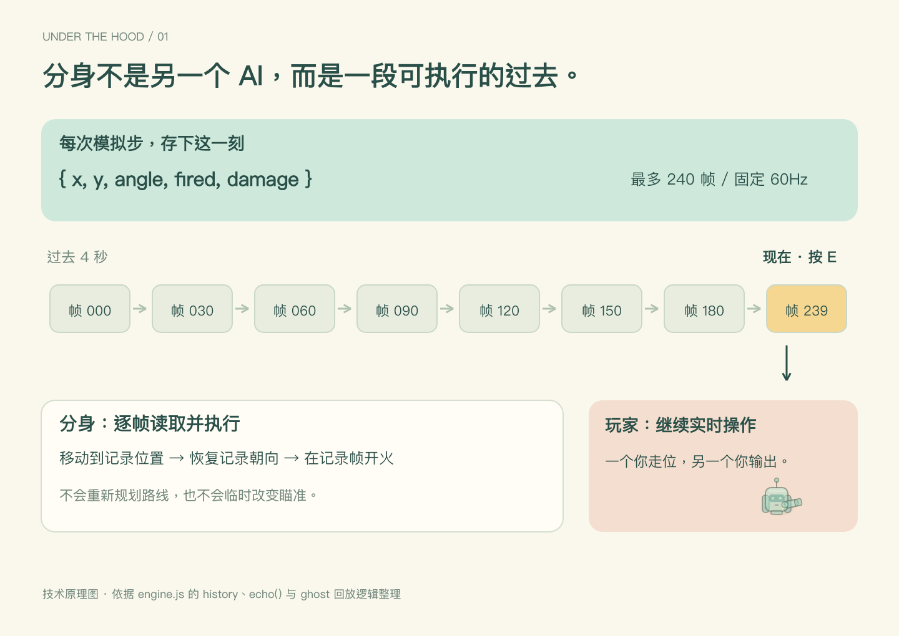
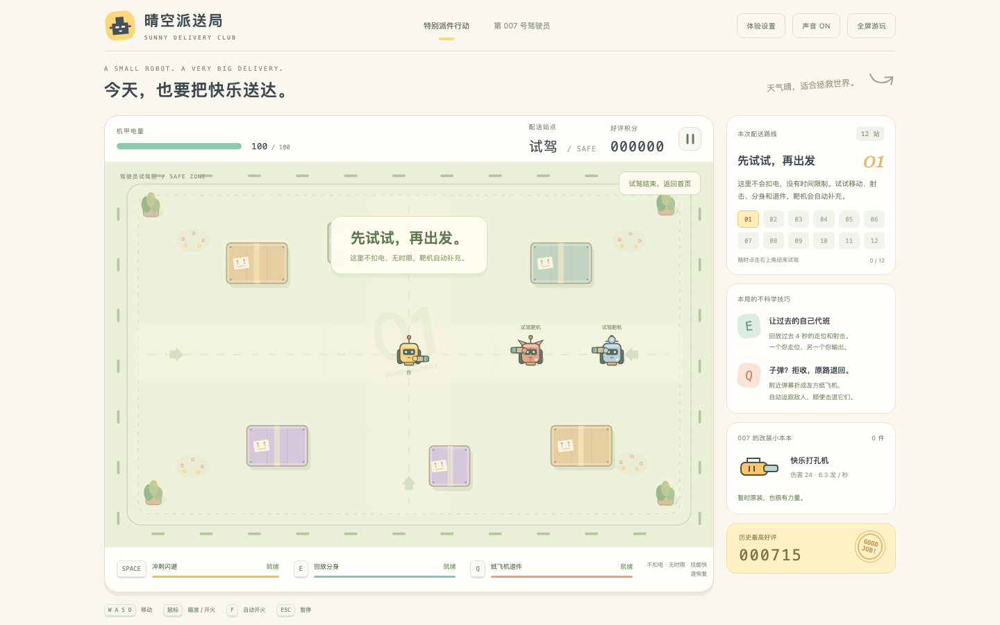
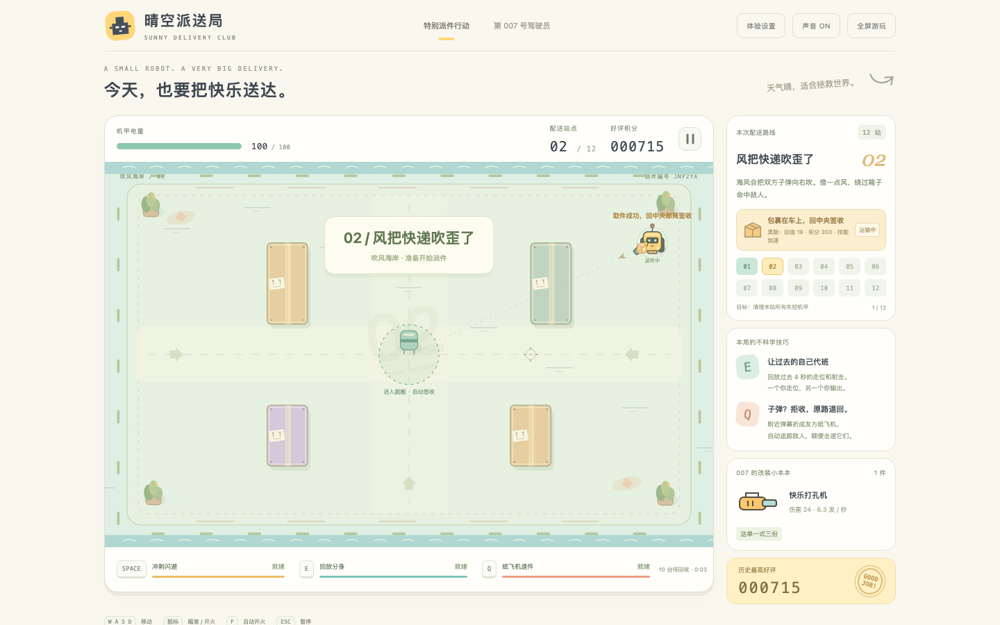
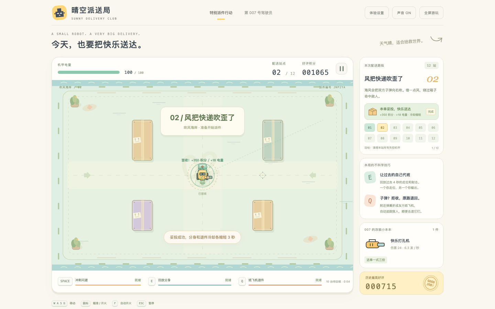
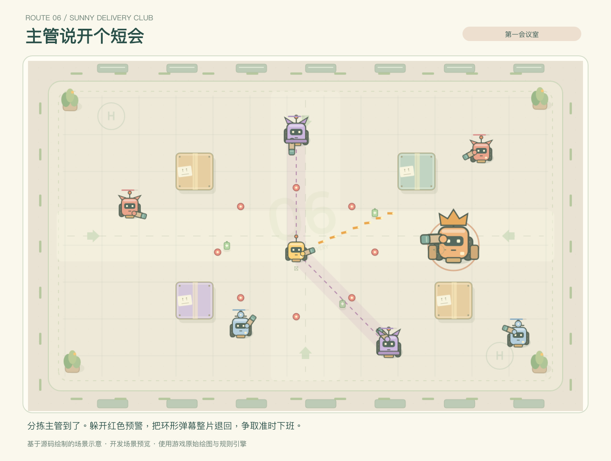
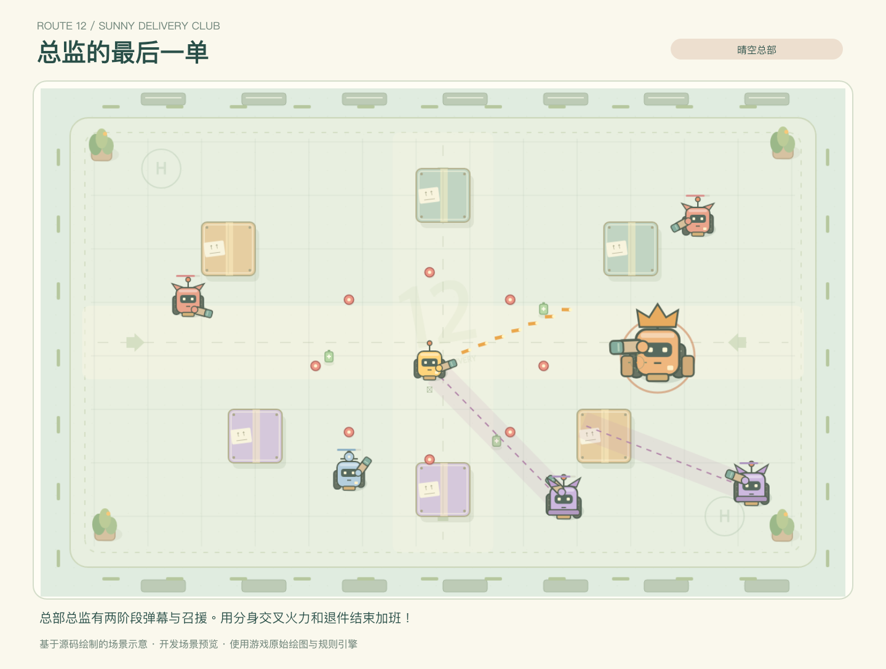
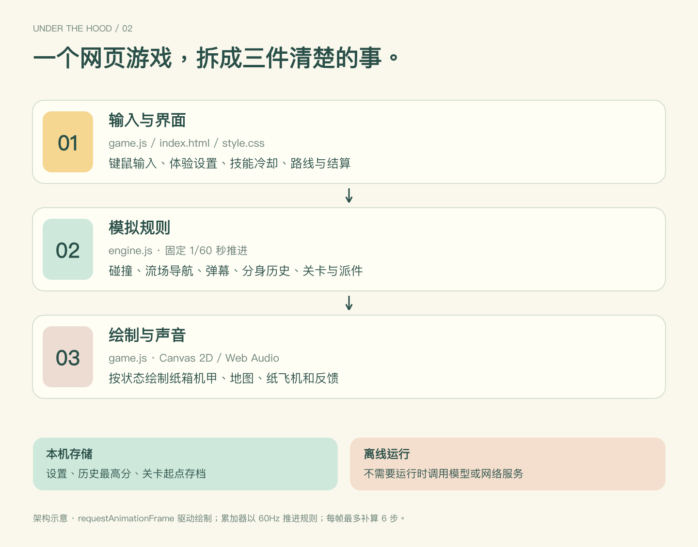

<div align="center">

# 晴空派送局
### SUNNY DELIVERY CLUB

> ⭐ 如果这个项目对你有帮助，或让你觉得有趣，欢迎点一下右上角的 **Star**。你的支持是我继续完善和分享作品的动力，谢谢！

**让过去的我继续开火，把敌人的子弹原路退件。**

纸箱机甲 · 时间分身 · 弹幕退回 · 本地离线


**12 个站点** · **2 场首领战** · **10 种改装** · **0 个运行时第三方依赖**

[立即开始](#立即开始) · [先看玩法](#三件有意思的事) · [操作说明](#操作说明) · [技术实现](docs/architecture.md) · [测试与边界](docs/testing.md)

</div>

《晴空派送局》是一款明亮、轻松又有点荒诞的俯视角机甲动作游戏。我把办公室里的“加班、退件、派送”变成了三个可以操作的机制：驾驶纸箱机甲清理街区，复制刚刚走过的路线，把对面的弹幕折成追踪纸飞机，顺路把包裹送到中央邮筒。

仓库中的独立 HTML 文件就是可以运行的游戏。当前版本为 **1.2.0**。


*配图说明：首页与试驾图来自浏览器功能验证；取件与签收图使用了预设测试状态。后期关卡图是按源码绘制的场景示意。图像用于展示界面与机制，不作为自然游玩或通关成绩。*

## 立即开始

### 只想玩

1. 在本页点击 **Code → Download ZIP**，下载并解压整个仓库。
2. 找到 **`晴空派送局.html`**，双击，用电脑上的近期版本 Chrome、Edge 或 Safari 打开。
3. 先点 **“先试驾驶”** 熟悉操作，再开始正式派送。

独立 HTML 已包含代码、样式与程序绘图，可以单独复制到其他文件夹。游戏运行不需要安装依赖、登录、联网或模型 API，不消耗 token。声音默认关闭，可按 `M` 打开。

> 推荐桌面键盘与鼠标。小屏幕会调整排版，但当前版本没有完整的手机触控操作或手柄支持。

### 想读源码或修改

需要 **Node.js 22 或更新版本**；没有 npm 依赖，不需要先执行 `npm install`。

```sh
git clone https://github.com/xiaom8413-afk/sunny-delivery-club.git
cd sunny-delivery-club
npm test
npm start
```

打开终端提示的 `http://127.0.0.1:4173`。服务只监听本机；端口占用时可用 `PORT=4174 npm start`。不启动服务器也可以直接打开 `index.html`，但必须保留相邻的 `style.css`、`engine.js` 和 `game.js`。

修改源码后运行：

```sh
npm run build
```

这会重新生成 `晴空派送局.html`。请修改源文件，避免只修改打包产物。

## 三件有意思的事

### 1. 过去的我来加班

按 `E` 不是召唤一个自动追踪敌人的队友，而是回放最近最多 **4 秒的真实走位、朝向与开火事件**。先绕到侧翼开火，再回到安全位置叫出分身，就能把刚才的进攻路线继续播放一遍。

第 4 站缩短分身冷却；第 7 站一次出现两位分身，其中一位稍晚到场。它把“之前怎么走”变成了“接下来怎么打”的一部分。



*机制示意图用于解释记录与回放的数据流程。*

### 2. 这件我拒收

按 `Q` 会把范围内的敌方子弹变成己方追踪纸飞机，并击退附近敌人。纸飞机会寻找视线内的目标；纸箱墙依然参与碰撞。面对弹幕时，除了躲开，还可以等它靠近再整片退回。

练习区不扣电、没有时限、靶机会补充，分身与退件冷却也更短。可以在这里放心试技能。



### 3. 打着打着，顺手把件送了

十个非首领站点各有一件可选包裹。靠近自动取件，再回到中央邮筒附近停留约 **0.65 秒**，即可完成签收，过程中仍能开火。

| 取件途中 | 返回中央邮筒签收 |
| --- | --- |
|  |  |

每次妥投奖励 **350 积分、18 点电量**，分身与退件冷却各减少 **3 秒**。包裹不强制完成，也不拖慢移动速度；它提供的是一条值得绕路的选择。携带包裹清场后，会额外留出最多 6 秒签收时间。

## 一条派送路线，十二种小变化

地图包含公园、海岸、分拣仓与屋顶四种装饰主题。十二套障碍布局各不相同，并保留种子变化；它们不是只换背景色的同一张地图。

| 站点 | 名字 | 本站变化 |
| --- | --- | --- |
| 01 | 第一单，别紧张 | 普通街区，熟悉走位、分身与退件 |
| 02 | 风把快递吹歪了 | 横风影响双方弹道 |
| 03 | 无理由退件日 | 哨兵增多，退件范围扩大、冷却减半 |
| 04 | 昨天的我真能干 | 分身冷却减半 |
| 05 | 传送带不想下班 | 两条反向传送带推动机甲 |
| 06 | 主管说开个短会 | 分拣主管：环形弹幕与瞄准齐射 |
| 07 | 一个我不够用了 | 一次复制两位分身 |
| 08 | 地板有点烫脚 | 带预警的周期性高温区 |
| 09 | 溜得快也是业绩 | 冲刺冷却缩短，落点产生伤害冲击 |
| 10 | 包裹自己飞过来 | 远距离吸取电池，并恢复技能冷却 |
| 11 | 全员加急，谢谢 | 敌机加速，玩家射速也提升 |
| 12 | 总监的最后一单 | 两阶段总部总监、密集弹幕与召援 |

| 第 6 站 · 分拣主管 | 第 12 站 · 晴空总部 |
| --- | --- |
|  |  |

*两张均为按源码绘制的场景示意，用于展示后期场景与首领，不代表自然游玩通关记录。*

前 11 站清场后恢复 20 点电量，并从三张随机改装卡中选一张。改装池共 10 种，包括散射、穿透、爆炸连锁、强化分身、扩大退件范围、提高移速、额外回血和增加电量上限。最多完成 11 次站间改装。

## 操作说明

| 操作 | 按键 |
| --- | --- |
| 移动 | `WASD` 或方向键 |
| 瞄准 / 射击 | 移动鼠标 / 按住左键 |
| 切换自动开火 | `F`，仍由鼠标瞄准 |
| 冲刺，短暂无敌 | `Space` |
| 过去的我来加班 | `E` |
| 这件我拒收 | `Q` |
| 暂停 / 继续 | `Esc` 或顶部暂停按钮 |
| 改装三选一 | 点击卡片，或 `1` / `2` / `3` |
| 开关声音 | `M` 或右上角按钮 |

底部技能按钮也可以点击，显示冷却时间和暂时不能使用的原因。设置界面可以随时打开；战斗中打开会自动暂停。

## 不必一上来就打得很紧张

- **悠闲派送（新游戏默认）**：受到伤害降低 35%，敌弹速度降低 15%，敌机移动速度降低 10%；常规分批出场同时最多 9 台。
- **标准派送**：原版伤害与速度；常规分批出场同时最多 14 台。旧存档默认仍使用标准模式。
- **辅助瞄准**：只微调准星附近、角度相近且无遮挡的目标，可关闭。
- **柔和动效（默认开启）**：关闭镜头震动与受击闪烁、减少粒子；保留必要预警。
- **操作引导、伤害数字、音量**：可以按自己的偏好调整。
- **独立试驾**：不影响正式派送存档，不写入正式分数，也不会产生通关。

## 存档与重试

每次进入新站点会保存检查点。刷新或关闭浏览器后，首页可选择“续送第 N 站”。失败重试保留**进入本站时**的装备与分数，并充满电量；不是恢复失败前一刻。暂停界面可以返回首页，之后也从本站起点继续。

存档、设置与最高分保存在当前浏览器的本地存储中，没有云同步。隐私模式、清理浏览器数据、禁用存储或移动独立 HTML 文件，都可能让存档不可用。重新开一单会覆盖上次派送进度；通关会清除本局检查点。

## 看得见的机制，也有可读的实现



- **原生 Canvas 2D + JavaScript**：界面、机甲、纸飞机、包裹与特效均由代码绘制；Web Audio 合成音效。
- **固定 60 Hz 模拟**：渲染帧与逻辑步进分离，每帧限制追赶次数。
- **两套 BFS 流场**：普通机甲与大型首领使用不同可通行区域，生成地图时检查连通性。
- **连续弹道检测**：用线段与圆 / 矩形求交比较最近命中，降低高速穿透与隔墙命中问题。
- **240 帧回放记录**：保存位置、朝向与开火事件，供时间分身重演。
- **逻辑与浏览器分层**：`engine.js` 不依赖 DOM，可直接在 Node.js 中运行测试。

```text
sunny-delivery-club/
├── index.html                 # 页面与界面结构
├── style.css                  # 布局、组件与响应式样式
├── engine.js                  # 状态、规则、碰撞、寻路与回放
├── game.js                    # 输入、Canvas 绘制、音效与本地存储
├── 晴空派送局.html              # 自包含离线游戏（由 build 生成）
├── build.cjs                  # 将本地源码内联进独立 HTML
├── server.cjs                 # 可选的本地静态服务器
├── tests/engine.test.cjs       # 20 项逻辑与战斗模拟测试
└── docs/                      # 架构、验证说明与展示图片
```

详细实现请看 [架构说明](docs/architecture.md)，运行方法和验证范围请看 [测试说明](docs/testing.md)。想提交问题或改进，先看 [贡献说明](CONTRIBUTING.md)。

## 验证范围与当前边界

2026-09-24 在发布副本运行 **20 项自动化测试，全部通过**，覆盖地图连通性、障碍碰撞、弹道顺序、分身回放、退件、关卡转换、存档、派件、试驾，以及完整十二站战斗模拟。

完整战斗模拟给予测试驾驶员无敌状态，目的是验证实际弹道、生成队列、两场首领战、升级和通关闭环，**不代表完成了普通玩家的难度评测**。20 项通过也不等于每个浏览器、每台设备、每个随机种子均无缺陷。

当前是桌面单人本地游戏：没有联机、云存档、完整移动端触控或游戏内模型服务。欢迎通过本仓库 Issues 报告可复现的问题。

## 使用与授权

本仓库暂未配置开源许可证。源码公开可见不等于授予任意使用、复制、再分发或商业使用的许可。作者保留相关权利；商业使用、商业转载、二次发布及其他授权事项，请先通过本仓库 Issues 联系作者确认。

个人原创，转载请注明作者及原文出处；涉及需要授权的使用，请先取得许可。
